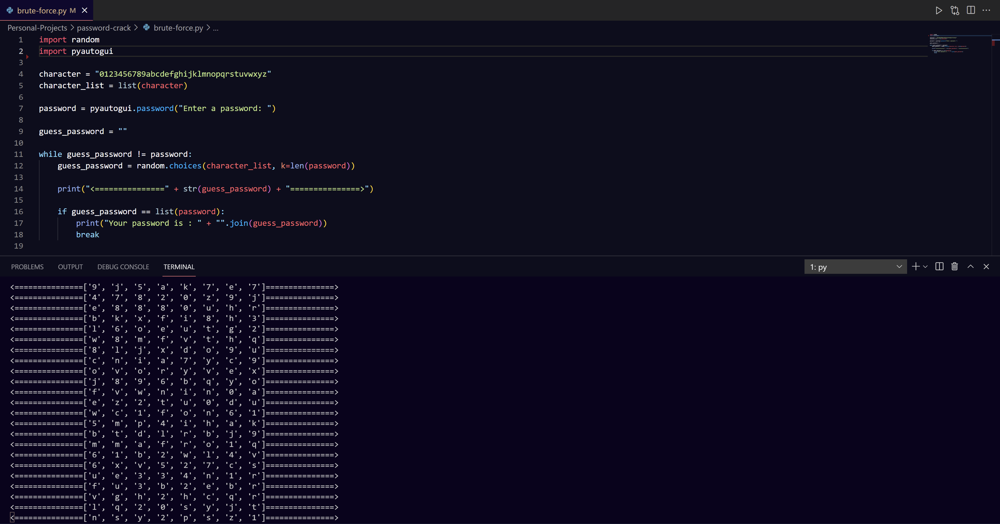

# Brute Force Password Cracker Demo

## Description

Here is a short repo made in python to show what a Brute Force Password Cracker does and how it can get the user's password by looping through all possible characters.

## Usage

Clone the repo and then insert the following command:

For Windows

```cmd
$ py brute-force.py
```

For Mac

```
$ python3 brute-force.py
```

Insert a word for the code to crack, and then watch the terminal as the code loops through every character to figure out the password.

## Application


